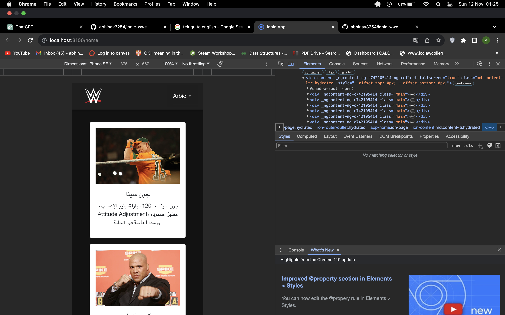
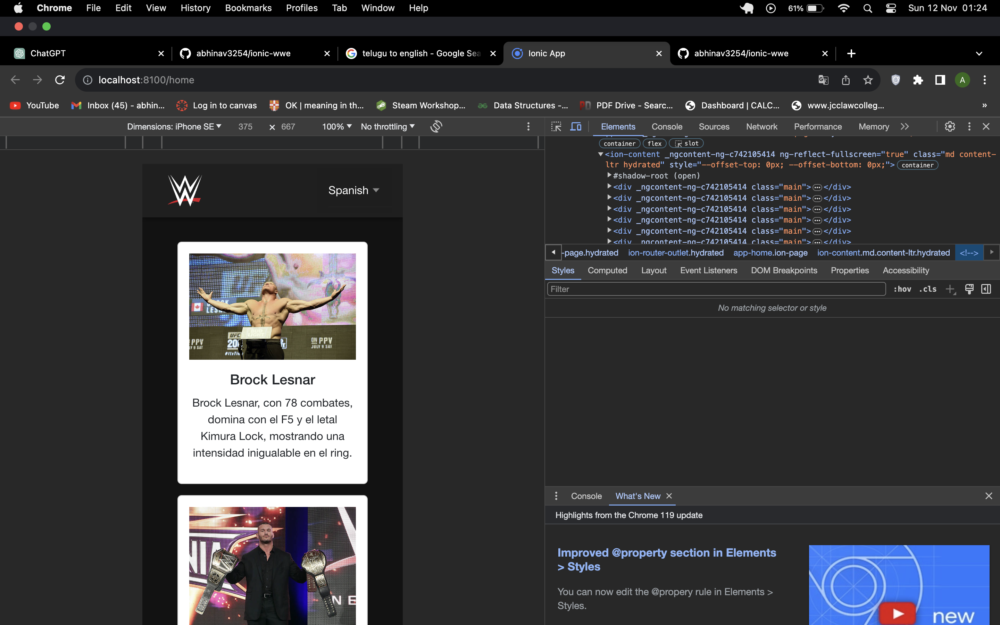

# WWE Superstars Guide

Welcome to the WWE Superstars Guide, an Ionic project dedicated to providing information about your favorite wrestling stars. Our main focus is to make the content accessible in multiple languages, allowing users from around the world to read, enjoy, and contribute by correcting and enhancing the content.


## Authors

- [@abhinav3254](https://www.github.com/abhinav3254)


## License

[MIT](https://choosealicense.com/licenses/mit/)

## Table of Contents

- [About](#about)
- [Features](#features)
- [Getting Started](#getting-started)
  - [Prerequisites](#prerequisites)
  - [Installation](#installation)
- [Usage](#usage)
- [Multi-Language Support](#multi-language-support)
- [Contributing](#contributing)
- [License](#license)   
- [snapshots](#snapshots)

## About

The WWE Superstars Guide is an Ionic project that offers comprehensive information about various WWE superstars. From their signature moves to career highlights, this app is your go-to source for all things related to WWE.

## Features

- Detailed profiles of WWE superstars
- Signature moves showcase
- Multi-language support for global accessibility
- Engaging images for each superstar

## Getting Started

Follow these steps to set up the project on your local machine.

### Prerequisites

Ensure you have the following tools installed:

- [Node.js](https://nodejs.org/)
- [Ionic CLI](https://ionicframework.com/docs/cli)

### Installation

1. Install Node.js
2. Install angular
3. Install ionic
4. Clone the repository and run this command
```
$sudo npm install
```
5. now run this command to serve ionic
```
ionic serve
```

## snapshots
1. English

2. Hindi

3. Telgu

4. Arbic

5. Spanish
