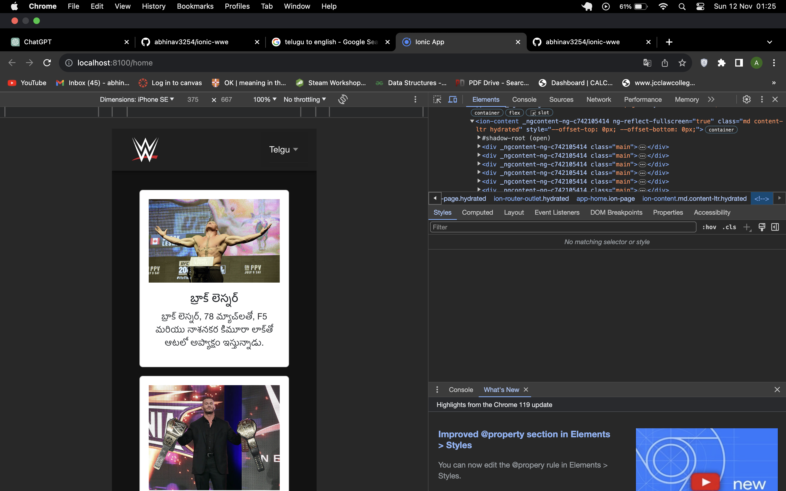

# WWE Superstars Guide

Welcome to the WWE Superstars Guide, an Ionic project dedicated to providing information about your favorite wrestling stars. Our main focus is to make the content accessible in multiple languages, allowing users from around the world to read, enjoy, and contribute by correcting and enhancing the content.


## Authors

- [@abhinav3254](https://www.github.com/abhinav3254)


## License

[MIT](https://choosealicense.com/licenses/mit/)

## Table of Contents

- [About](#about)
- [Features](#features)
- [Getting Started](#getting-started)
  - [Prerequisites](#prerequisites)
  - [Installation](#installation)
- [Usage](#usage)
- [Multi-Language Support](#multi-language-support)
- [Contributing](#contributing)
- [License](#license)   
- [snapshots](#snapshots)   
- [Contribution Rules](#contribution-rules)


## About

The WWE Superstars Guide is an Ionic project that offers comprehensive information about various WWE superstars. From their signature moves to career highlights, this app is your go-to source for all things related to WWE.

## Features

- Detailed profiles of WWE superstars
- Signature moves showcase
- Multi-language support for global accessibility
- Engaging images for each superstar

## Getting Started

Follow these steps to set up the project on your local machine.

### Prerequisites

Ensure you have the following tools installed:

- [Node.js](https://nodejs.org/)
- [Ionic CLI](https://ionicframework.com/docs/cli)

### Installation

1. Install Node.js
2. Install angular
3. Install ionic
4. Clone the repository and run this command
```
$sudo npm install
```
5. now run this command to serve ionic
```
ionic serve
```

# Contribution Rules

We appreciate your interest in contributing to our project. Before you start contributing, please take a moment to review and follow these guidelines:

## Code of Conduct

Please adhere to our [Code of Conduct](CODE_OF_CONDUCT.md). Be respectful, inclusive, and considerate in all interactions.

## Issues and Bugs

- Before creating a new issue, check if it already exists.
- Clearly describe the issue or bug, including steps to reproduce it.
- If possible, provide screenshots or code snippets that help illustrate the problem.

## Feature Requests

- Before making a feature request, ensure it hasn't been suggested before.
- Clearly describe the feature and its benefits.
- Provide any relevant details that might help implement the feature.

## Pull Requests

- Fork the repository and create a new branch for your contribution.
- Ensure your code follows the existing coding style and conventions.
- Provide clear and concise commit messages.
- Test your changes thoroughly before submitting a pull request.
- Update documentation if your changes affect it.

## Code Style

Follow the established coding style of the project. Consistent code style makes it easier to review and maintain the codebase.

## Testing

Ensure that your contributions don't break existing functionality. Write tests for new features or changes when applicable.

## Language and Localization

If you're contributing to language translations, make sure your translations are accurate and contextually appropriate.

## Continuous Integration

Changes should not break the continuous integration (CI) build. Ensure your code passes all tests and checks.

## License

By contributing, you agree that your contributions will be licensed under the project's [LICENSE](LICENSE).

Thank you for your contributions!


## snapshots
1. English

2. Hindi

3. Telgu

4. Arbic

5. Spanish
